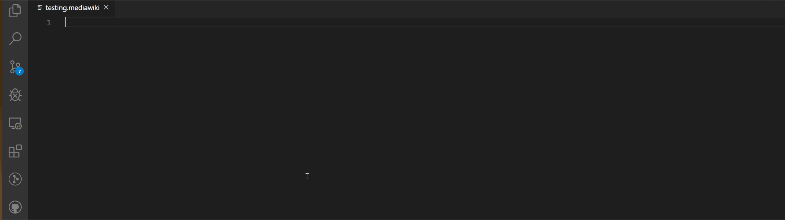

# mediawiki README

MediaWiki offers Syntax Highlighting for MediaWiki formats (including Wikipedia) plus other features to help edit MediaWiki documents.

## Features

### Web Citation

You can easily add [web citations](https://en.wikipedia.org/wiki/Template:Cite_web) directly from VSCode. Useful for when updating Wikipedia.  
Just add the URL and most of the parameters will be set.

Web Archive data is also added automatically.  
Example below:

## Release Notes

### 0.0.1

Initial release of MediaWiki

---

## Development

### Useful links

- [Textmate Language Grammars](https://macromates.com/manual/en/language_grammars)
- [BNF for media wiki](https://slebok.github.io/zoo/doc/wiki/mediawiki/bnf/connected/index.html#item-body)
- [Wikitext Cheatsheet](https://en.wikipedia.org/wiki/Help:Cheatsheet)

**Enjoy!**
